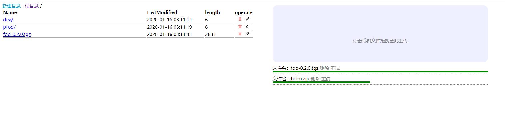

## dispatch

简单的云盘小程序



## build

amd64:
```bash
GOOS=linux GOARCH=amd64 go build .
```

## run

[docker hub](https://hub.docker.com/r/zhizuqiu/dispatch)

```
docker run -ti -p 8205:8080 zhizuqiu/dispatch:0.0.1
```

## 程序配置与环境变量

详见 [conf/app.conf](conf/app.conf)